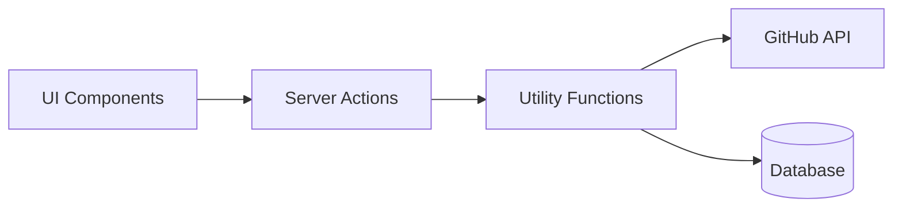
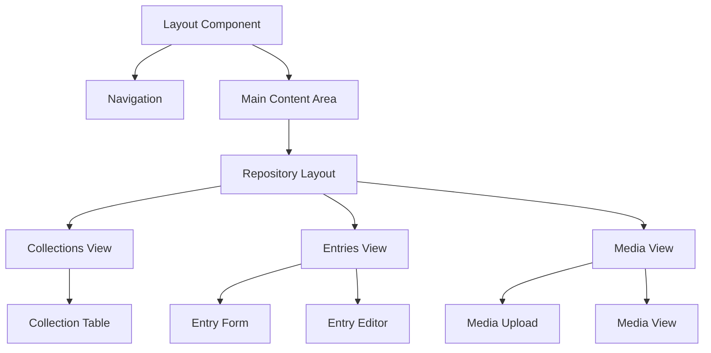
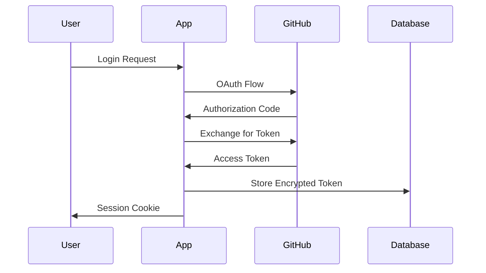
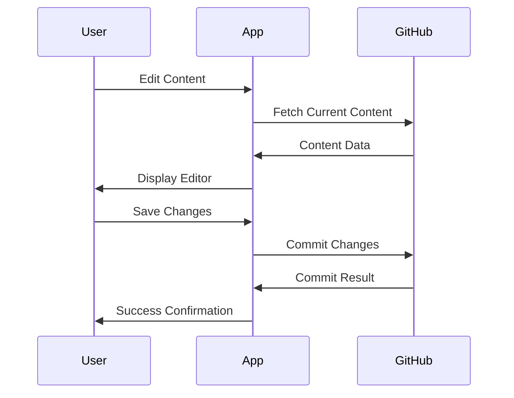
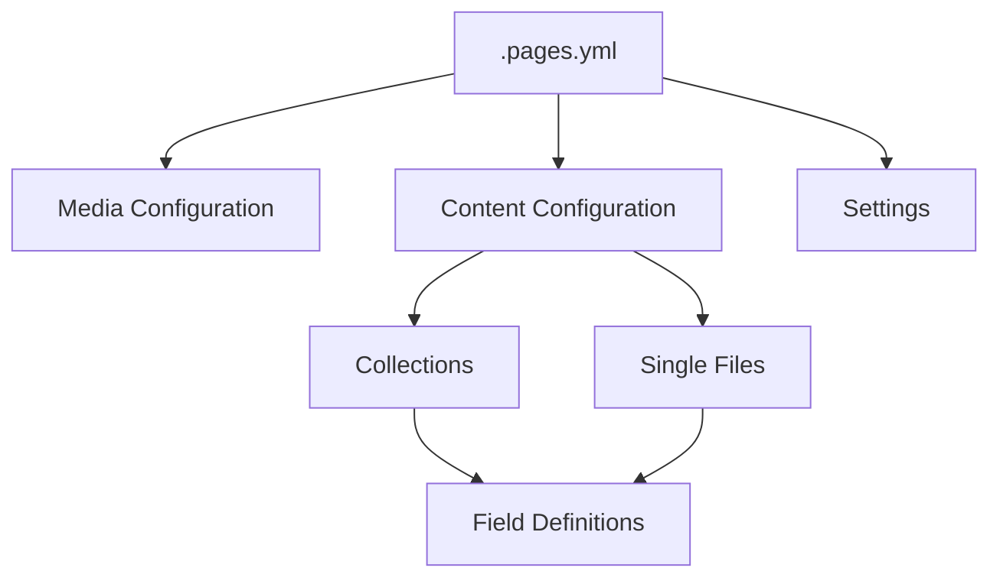

# System Patterns: Pages CMS

## Architecture Overview

Pages CMS follows a modern web application architecture with the following key components:

```mermaid
flowchart TD
    Client[Client Browser] <--> NextJS[Next.js App]
    NextJS <--> DB[(SQLite/Turso DB)]
    NextJS <--> GitHub[GitHub API]
    NextJS <--> Email[Email Service]
    
    subgraph "Core Components"
        Auth[Authentication]
        Repo[Repository Management]
        Content[Content Management]
        Media[Media Management]
        Collab[Collaboration]
    end
    
    NextJS --- Core Components
```

### Key Architectural Decisions

1. **Next.js App Router**: Using the latest Next.js app router for routing and API endpoints
2. **Server Components**: Leveraging React Server Components for improved performance
3. **SQLite/Turso**: Using SQLite locally and Turso for production for simplicity and performance
4. **GitHub App Integration**: Direct integration with GitHub via GitHub Apps for secure access
5. **Stateless Design**: No server-side session state, relying on tokens and database

## Core Design Patterns

### Repository Pattern

The system uses a repository pattern to abstract data access:



### Context Providers

React Context is used for global state management:

1. **UserContext**: Manages current user information and authentication state
2. **RepoContext**: Manages selected repository, branch, and related information
3. **ConfigContext**: Manages the configuration for the current repository

### Component Hierarchy



## Data Flow Patterns

### Authentication Flow



### Content Editing Flow



## Field System Architecture

The system uses a registry pattern for field types:

```mermaid
flowchart TD
    Registry[Field Registry] --> CoreFields[Core Fields]
    Registry --> CustomFields[Custom Fields]
    
    CoreFields --> String[String Field]
    CoreFields --> Number[Number Field]
    CoreFields --> Boolean[Boolean Field]
    CoreFields --> RichText[Rich Text Field]
    CoreFields --> Date[Date Field]
    CoreFields --> Image[Image Field]
    
    subgraph "Field Components"
        Edit[Edit Component]
        View[View Component]
        Validation[Validation Logic]
    end
    
    String --- Field Components
```

Each field type implements:
1. Edit component for modifying values
2. View component for displaying values
3. Validation logic
4. Serialization/deserialization logic

## Configuration System

The configuration is defined in a `.pages.yml` file in the repository root:



## Error Handling Strategy

1. **Client-side validation**: Form validation using React Hook Form and Zod
2. **Server-side validation**: API endpoint validation with Zod schemas
3. **Error boundaries**: React error boundaries for UI error containment
4. **Toast notifications**: User-friendly error messages via Sonner
5. **Logging**: Error logging for debugging and monitoring

## Security Patterns

1. **Token encryption**: GitHub tokens encrypted in the database
2. **Authentication**: GitHub OAuth and email-based authentication
3. **Authorization**: Repository-level permissions based on GitHub access
4. **CSRF protection**: Built-in Next.js CSRF protection
5. **Input validation**: Strict validation of all user inputs
